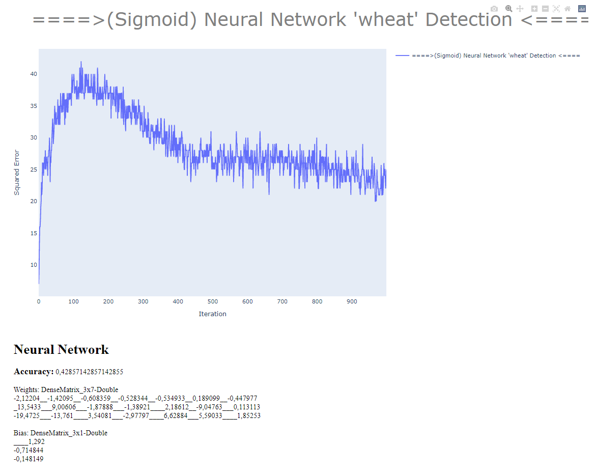

# Neural Network
Neural Network

## Installation

Download and install .Net Core 6 SDK [.Net Core Install instructions](https://dotnet.microsoft.com/en-us/download).
You can use any IDE you feel confortable editing, but Visual Studio is preferred.

## Executing
Execution:
````bash
$ dotnet run
````

----

# Execution
## Execution Parameters
| Parameter            	| Value 	                     |
|----------------------	|-------	                     |
| Max iterations    	| 1000    	                     |
| Evalutation Function  | Step + Sigmoid                 |
| Learning Rate         | 0.01 Regressive (LR / (i*0.1)) |


## Execution Result Charts

### **Using Step evaluation funcion**


### **Using Sigmoid evaluation funcion**



----

## Contributors

- Matheus Dutra Cerbino
- Eduardo Alves de Freitas

## ISSUES

If you have questions, concerns, bug reports, etc, please file an issue in this repository's Issue Tracker.

----

## Credits and references

1. Project made as a homework for "Artificial Inteligency" class of CEFET-MG college.
2. Project GitHub [GitHub](https://github.com/Pinacolada8/NeuralNetwork)
